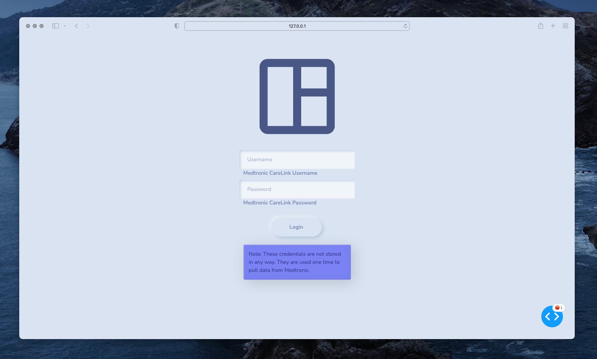
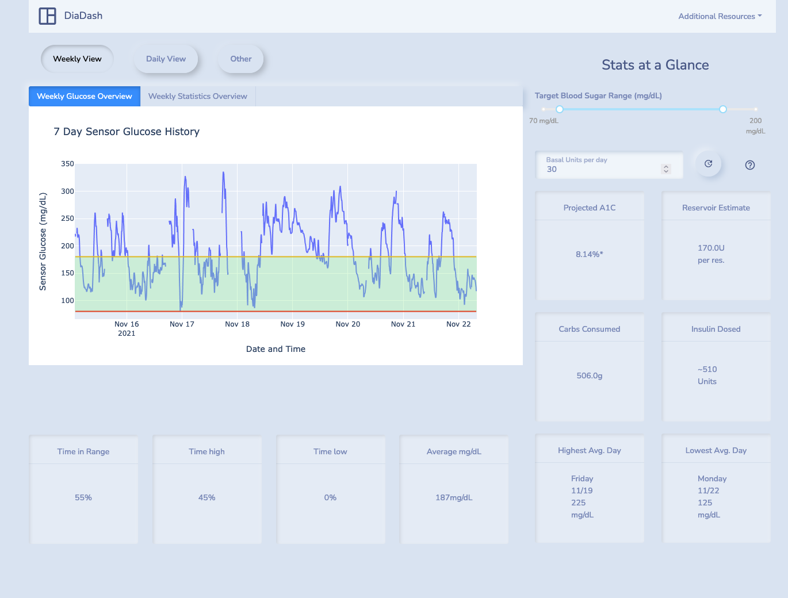
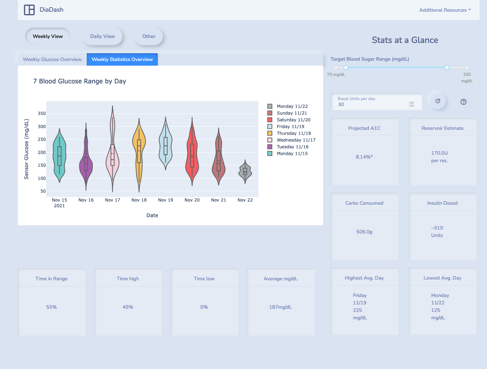
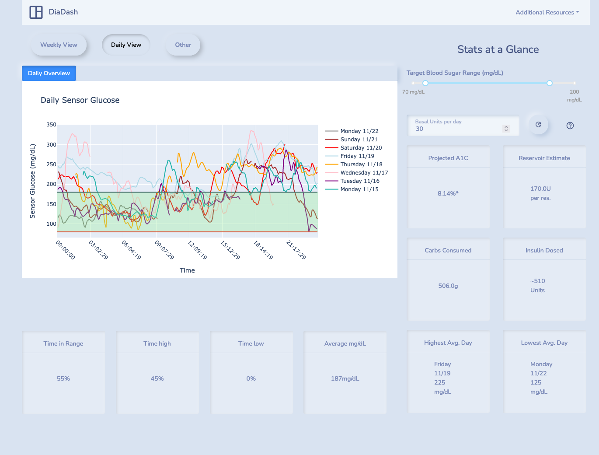
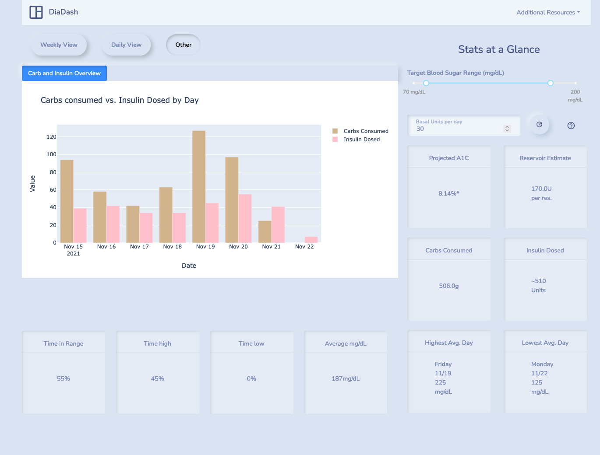

diadash
==============================

A lightweight and simplified dashboard built with Dash for viewing insulin pump data sourced from Medtronic's CareLink Portal.

This project was created to replace the static PDF reports that are available through Medtronic's CareLink Portal. It is a result of a perceived need to view more substantial and legible insights from a weeks worth of insulin pump data at a time.

Medtronic's 770G insulin pump has a companion mobile app (MiniMed Mobile) that continuously uploads blood glucose data from the pump to their CareLink site. This application leverages this system by performing an automated download of this data in 7 day increments for users to produce more legible visualizations and more impactful metrics/statistics to reference.

The major motivation for the dashboard is to, at a glance, have an understanding of the following:
- The amount of insulin used to optimize infusion loading and avoid waste.
- The amount of carbs that were consumed. 
- The percentage of time spent was spent within a specified mg/dL range.
- The longest stint of time spent in range.
- Identify daily trends to consider bolus/basal manipulation.
- (and in the future more)

## Important notes

First and foremost, while this data is sourced directly from Medtronic's CareLink service which is synced with an insulin pump and the Medtronic CareLink app, *these metrics and visualizations are for reference purposes only and are not intended to justify medical decisions*. **Always consult an endocrinologist before making any changes to a diabetes care routine.**

- **Projected A1C** - The metric card containing projected A1C is not an accurate estimation or representation of true A1C given that only 7 days of blood glucose data is available. It is only a representation of an A1C value of the previous 7 days and is intended to show the user a projection of an A1C value should the previous 7 days be characteristic of the next 3 months.

## Getting Started
This project assumes that you have pyenv and FireFox's GeckoDriver installed.

In the future I intend to implement a Dockerfile for deployment.

If you would like to create a pyenv environment you can do so with `make create_environment`. 
To then initialize that environment you may use `make init_environment`. 
Please note that this is completely optional.

--------
### Prerequisites
- Gecko Driver - Ensure `geckodriver` is installed with `geckodriver -V`
- Dependencies - To install dependencies run `make requirements`.

--------
## Usage
Desired flow (to be completed):
1. Launch the app with Docker
2. Navigate to URL
3. Provide Medtronic Credentials
4. View Dashboard

## Screenshots

 

 

*WIP

## To Do
- Make Dockerfile

--------

<small>Project based on the <a target="_blank" href="https://drivendata.github.io/cookiecutter-data-science/">cookiecutter data science project template</a>. #cookiecutterdatascience</small>

