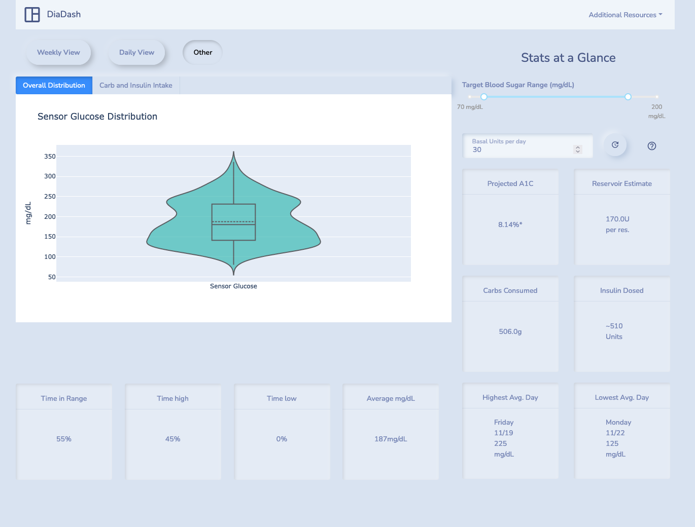

diadash
==============================

A lightweight and simplified dashboard built with Dash for viewing insulin pump data sourced from Medtronic's CareLink Portal.

This project was created to replace the static PDF reports that are available through Medtronic's CareLink Portal. It is a result of a perceived need to view more substantial and legible insights from a weeks worth of insulin pump data at a time.

Medtronic's 770G insulin pump has a companion mobile app (MiniMed Mobile) that continuously uploads blood glucose data from the pump to their CareLink site. This application leverages this system by performing an automated download of this data in 7 day increments for users to produce more legible visualizations and more impactful metrics/statistics to reference.

The major motivation for the dashboard is to, at a glance, have an understanding of the following:
- The amount of insulin used to optimize infusion loading and avoid waste.
- The amount of carbs that were consumed. 
- The percentage of time spent was spent within a specified mg/dL range.
- The longest stint of time spent in range.
- Identify daily trends to consider bolus/basal manipulation.
- (and in the future more)

## Important notes

First and foremost, while this data is sourced directly from Medtronic's CareLink service which is synced with an insulin pump and the Medtronic CareLink app, *these metrics and visualizations are for reference purposes only and are not intended to justify medical decisions*. **Always consult an endocrinologist before making any changes to a diabetes care routine.**

- **Projected A1C** - The metric card containing projected A1C is not an accurate estimation or representation of true A1C given that only 7 days of blood glucose data is available. It is only a representation of an A1C value of the previous 7 days and is intended to show the user a projection of an A1C value should the previous 7 days be characteristic of the next 3 months.

--------
### Prerequisites
- Gecko Driver - Ensure `geckodriver` is installed with `geckodriver -V`
- Dependencies - To install dependencies run `make requirements`.

--------
## Getting Started

### Local Testing
**Prerequisites**
If you are using a local virtual environment for Python, this project assumes that you have pyenv and FireFox's GeckoDriver installed. 

You can check  `geckodriver` is installed with `geckodriver -V`

Creating a virtual environment with pyenv (optional): 
1. Use  `make create_environment` to create the environment.
2. Use `make init_environment` initialize the environment and get into its shell.
3. Use `make requirements` to install all dependencies.
4. Use `make dash` to spin up the Dash app at [`localhost:8050`](localhost:8050).

**Uninstall/Cleanup**
You can remove the virtual environment completely with `make remove_environment`.


### Docker
This is the preferred development and deployment method of this project.

To compose the Diadash Docker image and spin up a *detached* container using that image use:
```
make docker-prod
```

Alternatively, you can spin up a development container with:
```
make docker-dev
```

Either command will make the application available at [`localhost:8050`](localhost:8050).

**Uninstall/Cleanup**
To remove the container and image produced with the above commands you can use: `make docker-remove`.


## Screenshots

 


 
 
*WIP

## To Do
- Ensure that Geckodriver is working correctly with Docker.

--------

<p><small>Project based on the <a target="_blank" href="https://drivendata.github.io/cookiecutter-data-science/">cookiecutter data science project template</a>. #cookiecutterdatascience</small></p>
