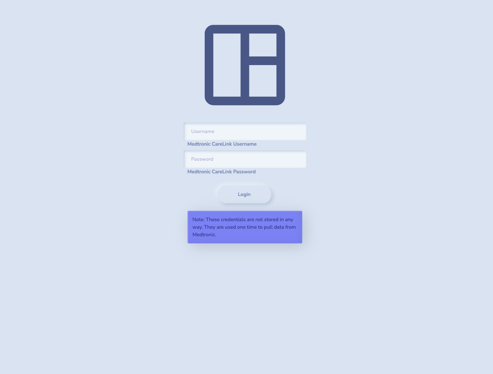

diadash
==============================

A lightweight and simplified dashboard built with Dash for viewing insulin pump data sourced from Medtronic's CareLink Portal.

This project was created to replace the static PDF reports that are available through Medtronic's CareLink Portal. It is a result of a perceived need to view more substantial and legible insights from a weeks worth of insulin pump data at a time.

The major motivation for the dashboard is to, at a glance, have an understanding of the following:
- The amount of insulin used to optimize infusion loading and avoid waste.
- The amount of carbs that were consumed. 
- The percentage of time spent was spent within a specified mg/dL range.
- The longest stint of time spent in range.
- The longest stint of time spent out of range.
- Identify daily trends to consider bolus/basal manipulation.
- (and in the future more)

## Getting Started
This project assumes that you have pyenv and FireFox's GeckoDriver installed.

In the future I intend to implement a Dockerfile for deployment.

If you would like to create a pyenv environment you can do so with `make create_environment`. 
To then initialize that environment you may use `make init_environment`. 
Please note that this is completely optional.

--------
### Prerequisites
- Gecko Driver - Ensure `geckodriver` is installed with `geckodriver -V`
- Dependencies - To install dependencies run `make requirements`.

--------
## Usage
Desired flow (to be completed):
1. Launch the app with Docker
2. Navigate to URL
3. Provide Medtronic Credentials
4. View Dashboard

## Screenshots

 
*WIP

## To Do
- Add metric card for estimated reservoir amount
- Add metric for projected A1C
- Third View will become insulin and carb overview.
- Make Dockerfile

--------

<small>Project based on the <a target="_blank" href="https://drivendata.github.io/cookiecutter-data-science/">cookiecutter data science project template</a>. #cookiecutterdatascience</small>

